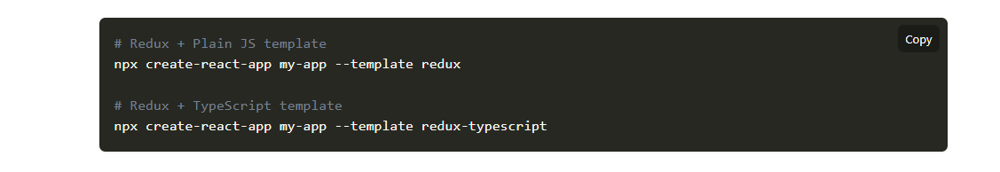
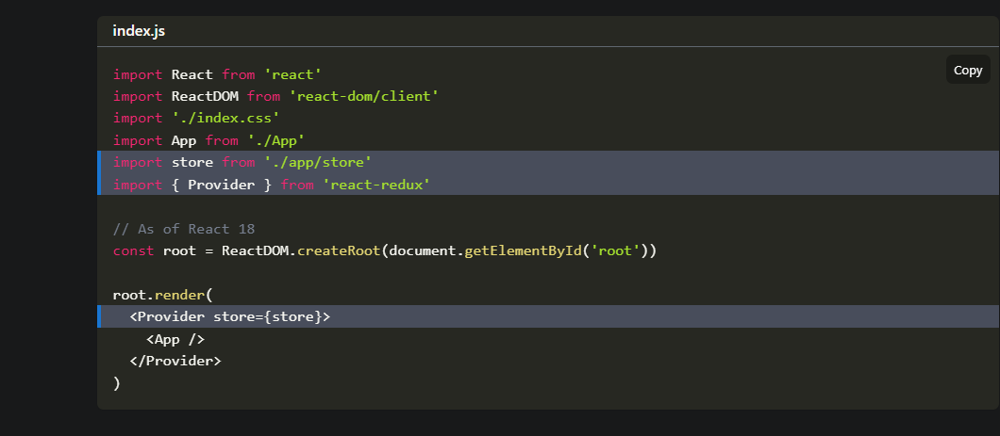
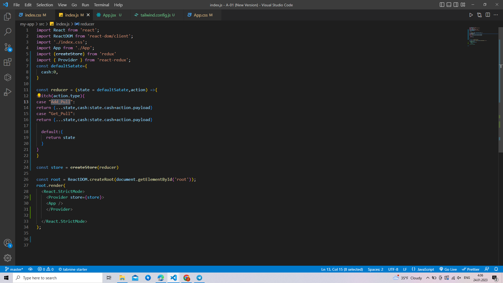
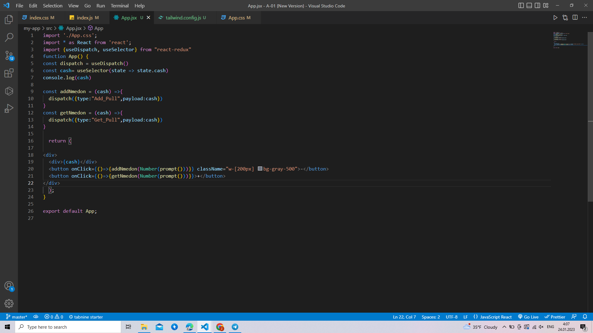

# Installation
## React Redux 8.x requires React 16.8.3 or later / React Native 0.59 or later, in order to make use of React Hooks.

# Using Create React App
## The recommended way to start new apps with React and Redux is by using the official Redux+JS template or Redux+TS template for Create React App, which takes advantage of Redux Toolkit and React Redux's integration with React components

# An Existing React App
## To use React Redux with your React app, install it as a dependency:

# If you use npm:
npm install react-redux

# Or if you use Yarn:
yarn add react-redux

# Provide the Redux Store to React
## Once the store is created, we can make it available to our React components by putting a React Redux <Provider> around our application in src/index.js. Import the Redux store we just created, put a <Provider> around your <App>, and pass the store as a prop:

# After it we can put logic

